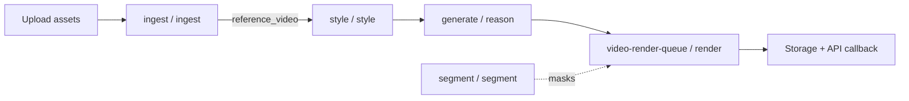

# Python Services Guide

This document walks through the Python workers under `services/`. Each worker is a
[Temporal](https://temporal.io/) worker that polls a task queue, executes
activities, and advances a generation/render job. There is also a standalone
`orchestrator.py` CLI for local, non-Temporal runs.

## Layout

```
services/
├── ingest-worker/     # Asset probing, beats, shots, heatmaps, faces
├── style-worker/      # LUT, motion, transitions, text, Style Genome
├── reason-worker/     # Cutlist generation, clip ranking, audio mix
├── render-worker/     # FFmpeg timeline compiler + identity matting
├── segment-worker/    # SAM3 subject segmentation
├── upscale-worker/    # Real-ESRGAN / Topaz upscaling
├── shared-py/         # Models, config, logging, storage, AI providers
└── orchestrator.py    # Standalone CLI pipeline
```

## Pipeline Overview



1. **Ingest** probes uploaded assets, detects beats (songs), shot boundaries
   (videos), heatmaps (clips), and face embeddings (clips).
2. **Style** analyzes a reference video in parallel: LUT extraction, camera
   motion, transition classification, text overlays, and the 50-feature
   *Style Genome* fingerprint.
3. **Reason** generates a beat-synced `CutList`, ranks user clips for each slot,
   and decides transitions/audio.
4. **Render** downloads the required clips/audio, builds identity-aware SAM3
   masks, and compiles the final MP4 with FFmpeg.
5. **Segment** is invoked independently to create subject masks; those masks are
   later consumed by the render worker.

---

## `services/ingest-worker/`

Entry point: `src/ingest_worker/__main__.py::main()`
Task queue: `ingest`
Workflow: `ProbeAssetWorkflow`

### Key files

| File | Responsibility |
|------|----------------|
| `src/ingest_worker/__main__.py` | Registers the worker, task queue `ingest`, workflow `ProbeAssetWorkflow`, and four activities. |
| `src/ingest_worker/workflows.py` | `ProbeAssetWorkflow.run()` calls `probe_asset`, then branches on `asset_type`: songs get beat detection, reference videos/clips get shot detection, and clips get a heatmap. Reference videos also start a child `AnalyzeStyleWorkflow` on the `style` queue with `ParentClosePolicy.ABANDON`. |
| `src/ingest_worker/activities.py` | Temporal activity wrappers: `probe_asset`, `detect_beats_activity`, `detect_shot_boundaries_activity`, `compute_clip_heatmap_activity`. Downloads assets, runs analysis, and PATCHes metadata back to the internal API via `_patch_asset_metadata()`. |
| `src/ingest_worker/probe.py` | `probe_video()` probes a local file with PyAV; `probe_asset_remote()` downloads from R2, probes, and reports width/height/fps/duration to `/internal/assets/{id}/probe`. Defines `ProbeInfo`/`VideoProbeResult`. |
| `src/ingest_worker/beat_detect.py` | `detect_beats()` decodes audio via FFmpeg and tries `allin1` first, falling back to `librosa` (`detect_beats_librosa`). `compute_energy_curve()` returns a normalized 64-point RMS curve. `_detect_structure_librosa()` assigns intro/verse/chorus/drop/bridge/outro labels. |
| `src/ingest_worker/shot_detect.py` | `detect_shot_boundaries()` uses PySceneDetect by default (`detect_shot_boundaries_pyscenedetect`) and can fall back to TransNet V2 (`detect_shot_boundaries_transnet`). |
| `src/ingest_worker/heatmap.py` | `ClipWindow` dataclass and `compute_clip_heatmap()` that fuses motion, aesthetic, sharpness, audio onset, and stability scores. Includes disk-cached variants `compute_clip_heatmap_cached()` and `compute_clip_heatmaps_batch()`. `heatmap_to_metadata()` serializes results. |
| `src/ingest_worker/identity.py` | `FaceDetection`, `_get_face_app()` (InsightFace `buffalo_l`), `extract_faces_from_clip()`, batched `extract_faces_from_clips()`, and cached loaders `ensure_faces()` / `ensure_faces_for_clips()`. JSON caches are written next to the source clip. |
| `tests/test_heatmap.py` | Heatmap scoring tests. |
| `tests/test_identity.py` | Face cache and detection tests. |

---

## `services/style-worker/`

Entry point: `src/style_worker/__main__.py::main()`
Task queues: `style`
Workflows: `AnalyzeStyleWorkflow`, `AnalyzeGenomeWorkflow`

### Key files

| File | Responsibility |
|------|----------------|
| `src/style_worker/__main__.py` | Registers the `style` worker with both workflows and all style activities. |
| `src/style_worker/workflows.py` | `AnalyzeStyleWorkflow` downloads a reference video and runs LUT, motion, transition, and text activities in parallel. `AnalyzeGenomeWorkflow` extracts the 50-feature Style Genome. Both clean up via `cleanup_style_assets`. |
| `src/style_worker/activities.py` | `download_reference_video`, `extract_lut`, `detect_text_overlays`, `analyze_motion`, `classify_shot_transitions`, `extract_genome_activity`, `cleanup_style_assets`. `extract_lut()` uploads the generated `.cube` file to R2 and registers it as a `lut` asset. |
| `src/style_worker/lut_extract.py` | `extract_lut_from_reference()` samples frames, builds an identity LUT image, and blends a color-matched LUT via HM-MVGD-HM (`_extract_lut_color_matcher`) or a Reinhard fallback (`_extract_lut_reinhard`). `_build_style_analysis()` computes palette, contrast, saturation, brightness. |
| `src/style_worker/transition_type.py` | `classify_transitions()` labels each shot boundary as `hard_cut`, `dissolve`, `fade`, `wipe_*`, or `whip` using inter-frame diffs, luminance monotonicity, and motion blur. |
| `src/style_worker/text_extract.py` | `extract_text_overlays()` runs PaddleOCR at a sampled FPS, groups detections into tracks with IoU, and returns `Overlay` objects. `compute_iou()` computes quadrilateral IoU. |
| `src/style_worker/camera_motion.py` | `analyze_camera_motion()` classifies each shot as `static`, `handheld`, `pan_*`, `tilt_*`, `zoom_*`, or `gimbal` using affine transforms estimated from optical flow. |
| `src/style_worker/genome/extract.py` | `extract_genome()` is the entry point. It gathers video info, shot boundaries, normalized style analysis, and delegates to five feature families. `_video_info()` and `_detect_shot_boundaries()` provide cheap fallbacks. |
| `src/style_worker/genome/families/cut_rhythm.py` | `extract_cut_rhythm()` returns 15 pacing features: cut counts, durations, densities per section, hard/gradual ratios, downbeat alignment. |
| `src/style_worker/genome/families/motion.py` | `extract_motion_genome()` returns 12 motion features including average/max motion energy and percentages of pan/tilt/zoom/handheld/gimbal. |
| `src/style_worker/genome/families/dwell.py` | `extract_dwell_genome()` returns 8 subject-presence features using face detections from project clips or sampled video frames. |
| `src/style_worker/genome/families/audio_align.py` | `extract_audio_align_genome()` returns 10 features measuring how often cuts land on beats/downbeats inside verse/chorus/drop sections plus duck/dialogue metrics. |
| `src/style_worker/genome/families/composition.py` | `extract_composition_genome()` returns 5 composition features: dominant shot size, close/medium/wide percentages, and rule-of-thirds ratio. |
| `src/style_worker/genome/storage.py` | `save_genome_json()` / `load_genome_json()` for persisting `StyleGenome` objects. |
| `tests/test_genome.py` | Validates 50 features, family counts, and JSON round-trip. |

---

## `services/reason-worker/`

Entry point: `src/reason_worker/__main__.py::main()`
Task queue: `generate`
Workflow: `GenerateFromReferenceWorkflow`

### Key files

| File | Responsibility |
|------|----------------|
| `src/reason_worker/__main__.py` | Registers the `reason` worker with `GenerateFromReferenceWorkflow` and its activities. |
| `src/reason_worker/workflows.py` | `GenerateFromReferenceWorkflow` fetches project context, ensures beat grid + shot boundaries, generates a cutlist, ranks clips, saves the result, and reports progress/failures. |
| `src/reason_worker/activities.py` | `publish_progress_activity`, `fetch_project_context`, `ensure_beat_grid`, `ensure_shot_boundaries`, `generate_cutlist_activity`, `rank_clips_activity`, `save_generated_cutlist`, `fail_generation_job`. |
| `src/reason_worker/cutlist_gen.py` | `generate_cutlist()` walks the `AI_PROVIDER` chain (default `programmatic`) and falls back to `generate_cutlist_programmatic()`. Defines the JSON schema `CUTLIST_SCHEMA`, tier gating `STYLE_TIERS`, and `_snap_slots_to_shots_and_beats()` for beat/shot snapping. |
| `src/reason_worker/clip_rank.py` | `rank_clips_for_slots()` scores each clip per slot using semantic, shot-type, aesthetic, motion, duration, and heatmap-window signals. Supports repetition penalties, exhaust bonuses, usage caps, Marengo embeddings, momentum re-ranking (`rerank_with_momentum()`), and anticipation offsets (`apply_anticipation_offsets()`). `compute_confidence()` derives slot confidence from score gaps. |
| `src/reason_worker/transition_select.py` | `select_xfade()` maps outgoing/incoming motion + reference archetype to an FFmpeg `xfade` preset. `motion_direction_around_cut()` computes optical-flow direction; `classify_reference_transition_archetypes()` reduces boundaries to `hard_cut`, `dissolve`, `fade`, `whip`, or `match_cut`. |
| `src/reason_worker/audio_mix.py` | `SectionPolicy`, `DEFAULT_POLICIES`, and `build_audio_tracks()` split the music bed by song section and add sidechain-ducked dialogue tracks extracted from selected clip windows. |
| `src/reason_worker/audio_scoring.py` | `DialogueSegment`, `ScoringConfig`, and `score_clip_dialogue()` use OpenAI Whisper when available, otherwise a spectral heuristic. Includes iconic-phrase matching via `_phrase_match_score()`. |
| `src/reason_worker/anticipation.py` | `precompute_clip_motion_curve()` caches per-frame motion magnitude. `find_motion_peaks_in_window()` finds dominant peaks. `compute_anticipation_offset()` shifts a source window so the cut lands ~333 ms before the peak. |
| `src/reason_worker/momentum.py` | `compute_mean_flow_vector()` averages Farneback optical flow over `n_frames`. `momentum_coherence()` scores how well incoming motion continues outgoing motion. |
| `src/reason_worker/protagonist_pick.py` | `load_faces_for_project()` reads cached `.faces.json` files; `select_protagonists()` clusters faces and returns top protagonists. |
| `src/reason_worker/lyric_overlays.py` | `generate_slot_text_overlay()` is a placeholder for lyric-aware text; `should_render_behind_subject()` gates "behind subject" text layers. |
| `src/reason_worker/aspect_detect.py` | `detect_aspect_preset()` maps width/height to `youtube_16_9`, `reels_9_16`, `square_1_1`, or `cinema_2_35`. |
| `src/reason_worker/generative_client.py` | Generative video providers for filler/transition clips: `VideoProvider` base, `GeminiVeoProvider`, `_OpenAICompatibleVideoProvider`, `SeedanceProvider`, `KlingProvider`, `MockProvider`, and `CompositeProvider`. Factory: `get_generative_provider()`. |
| `src/reason_worker/marengo_client.py` | `MarengoClient` wraps the Twelve Labs Embed API v2 for text/video embeddings used by the clip ranker. |
| `src/reason_worker/filler_prompt.py` | `build_filler_prompt()` and `build_transition_prompt()` convert a slot into a generative-video prompt using shot-type, motion, transition, and style-analysis dictionaries. |
| `tests/` | `test_anticipation.py`, `test_aspect_detect.py`, `test_audio_mix.py`, `test_audio_scoring.py`, `test_clip_rank_exhaust.py`, `test_clip_rank_momentum.py`, `test_duration.py`, `test_lyric_overlays.py`, `test_momentum.py`, `test_protagonist_pick.py`, `test_snap_priority.py`, `test_transition_select.py`, `test_workflow.py`. |

---

## `services/render-worker/`

Entry point: `src/render_worker/__main__.py::main()`
Task queue: `video-render-queue`
Workflow: `VideoRenderWorkflow`

### Key files

| File | Responsibility |
|------|----------------|
| `src/render_worker/__main__.py` | Registers the `render` worker with `VideoRenderWorkflow` and its activities. |
| `src/render_worker/workflows.py` | `VideoRenderWorkflow` fetches the project/cutlist, downloads required assets, calls `compile_render`, uploads the output, marks the render complete, and cleans up in a `finally` block. |
| `src/render_worker/activities.py` | `fetch_project`, `download_render_assets`, `compile_render`, `upload_render`, `complete_render`, `cleanup_render_assets`. `compile_render()` downloads LUTs/masks, resolves export dimensions, auto-enables NVENC, builds a `RenderConfig`, and calls `compile_timeline()`. |
| `src/render_worker/compiler.py` | The FFmpeg-based renderer. `compile_timeline()` (main entry), `resolve_render_dimensions()`, `_video_encode_args()`, `_segment_video_args()`, `_apply_video_effects()`, `_build_audio_filter_v2()`, `_build_music_volume_filter()`, `_build_dialogue_bus()`, `XFADE_MAP`, `_run_ffmpeg()`, `_safe_path()`, `_has_nvenc()`. Supports effects (zoom, vignette, film grain, shake, focus pull, glitch, color pop, text), transitions via `xfade`, and sidechain-ducked dialogue. |
| `src/render_worker/identity_matte.py` | `build_identity_masks()` ensures faces for selected clips, picks protagonists, records which identities are present per slot, and requests SAM3 mask videos via `generate_subject_mask_for_identity()`. `blank_mask_video()` is a helper for future mask generation. |
| `tests/` | `test_anticipation_seek.py`, `test_identity_matte.py`, `test_zindex_text.py`. |

---

## `services/segment-worker/`

Entry point: `src/segment_worker/__main__.py::main()`
Task queue: `segment`
Workflow: `SegmentSubjectWorkflow`

### Key files

| File | Responsibility |
|------|----------------|
| `src/segment_worker/__main__.py` | Registers the `segment` worker with `SegmentSubjectWorkflow` and the `segment_subject` activity. |
| `src/segment_worker/workflows.py` | `SegmentSubjectWorkflow` runs `segment_subject` and exposes a `get_result` query. |
| `src/segment_worker/activities.py` | `segment_subject()` downloads an asset, runs image/video segmentation, persists base64 masks as first-class `mask` assets, and PATCHes segmentation metadata back to the source asset. Includes payload guards. |
| `src/segment_worker/engine.py` | Facade: `is_segmentation_available()`, `detect_subject_mask_image()`, `detect_subject_mask_video()`, `generate_subject_mask_for_identity()` (wraps video masks into an MP4). |
| `src/segment_worker/client.py` | `Sam3Segmenter` lazy-loads SAM3 modules and runs open-vocabulary image/video segmentation. `available()` is `False` when SAM3, PyTorch, or `HF_TOKEN` are missing, so the pipeline degrades gracefully. |
| `tests/` | `test_activities.py`, `test_client.py`, `test_engine.py`, `test_segment_workflow.py`. |

---

## `services/upscale-worker/`

A small optional worker for post-render upscaling.

| File | Responsibility |
|------|----------------|
| `src/upscale_worker/realesrgan.py` | `upscale_with_realesrgan()` extracts frames, upscales each with `realesrgan-ncnn-vulkan`, and re-encodes with the original audio. |
| `src/upscale_worker/topaz.py` | `upscale_with_topaz()` submits a job to the Topaz Video AI API and polls for completion. |

---

## `services/shared-py/`

Library code used by all workers. It is not a Temporal worker itself.

| File | Responsibility |
|------|----------------|
| `src/shared_py/models.py` | Pydantic `BaseModelCamel` models: `CutList`, `Slot`, `Overlay`, `AudioTrack`, `BeatGrid`, `ShotBoundary`, `StyleAnalysis`, `StyleGenome`/`StyleGenomeFamilies`, `RenderConfig`, `ClipScore`, `Identity`, etc. |
| `src/shared_py/config.py` | `Settings` (Pydantic-Settings) and lazy `settings` proxy for R2, Redis, Temporal, AI keys, beat-snap radii, and API base URL. |
| `src/shared_py/logging_config.py` | `configure_logging()`, `JsonFormatter`, `StructuredLogger`, and `bind_correlation_id_from_temporal()`. |
| `src/shared_py/storage.py` | `download_asset()`, `upload_file()`, `delete_asset()`, `get_presigned_download_url()`. Uses `boto3` with path-style addressing for local/S3-compatible endpoints. |
| `src/shared_py/identity_cluster.py` | `Identity` dataclass, `cluster_project_identities()` (DBSCAN on face embeddings), and `pick_protagonists()` (screen-time weighted scoring). |
| `src/shared_py/tuning.py` | Centralized constants: `RANK`, `FLOW`, `MOMENTUM`, `ANTICIPATION`, `IDENTITY`, `COMPILER` dataclasses. |
| `src/shared_py/startup.py` | `validate_startup()` checks required env vars (`R2_*`, `REDIS_URL`, `DATABASE_URL`, `INTERNAL_WORKER_TOKEN`) and warns about AI provider keys. |
| `src/shared_py/worker_runner.py` | `run_worker()` connects to Temporal, starts a `Worker`, handles reconnects and graceful shutdown. |
| `src/shared_py/aesthetic.py` | Image aesthetic scoring helper used by the heatmap module. |
| `src/shared_py/user_events.py` | User-event tracking helpers. |
| `src/shared_py/tracing.py` | Tracing/OpenTelemetry utilities. |
| `src/shared_py/ai_providers/base.py` | `AIProvider` abstract base with shared prompts (`SYSTEM_PROMPT_CUTLIST`, etc.) and `_build_cutlist_context()`. |
| `src/shared_py/ai_providers/factory.py` | `get_ai_provider()` maps names (`claude`, `gemini`, `kimi`, `groq`, `openrouter`, `openai`, `qwen`, `programmatic`) to provider classes. |
| `src/shared_py/ai_providers/programmatic_provider.py` | `ProgrammaticProvider` zero-LLM fallback that delegates to `reason_worker.cutlist_gen.generate_cutlist_programmatic`. |
| `src/shared_py/ai_providers/claude_provider.py` | `ClaudeProvider` with forced tool-use (`emit_cutlist`) for structured cutlist output. |
| `src/shared_py/ai_providers/gemini_provider.py` | `GeminiProvider` using `response_mime_type="application/json"`. |
| `src/shared_py/ai_providers/kimi_provider.py`, `openai_provider.py`, `groq_provider.py`, `openrouter_provider.py`, `qwen_provider.py` | OpenAI-compatible provider implementations. |
| `tests/test_identity_cluster.py` | Identity clustering tests. |
| `tests/test_worker_runner.py` | Worker runner tests. |

---

## `services/orchestrator.py`

Standalone CLI pipeline that runs the same modules without Temporal. Useful for
local testing and debugging.

- `run_pipeline()` orchestrates probe → shot detection → beat detection → LUT /
  overlays / motion / transitions → cutlist generation → clip ranking → FFmpeg
  render.
- `main()` parses `--reference`, `--song`, `--clips`, `--output`, `--tier`,
  `--mode`, and `--temp-dir`.

It uses `compile_timeline()` from the render worker directly, so the output path
and behavior match the Temporal render path when no masks are involved.

---

## How the Services Fit into Temporal

| Worker | Task queue | Workflow(s) | Activities |
|--------|------------|-------------|------------|
| `ingest-worker` | `ingest` | `ProbeAssetWorkflow` | `probe_asset`, `detect_beats_activity`, `detect_shot_boundaries_activity`, `compute_clip_heatmap_activity` |
| `style-worker` | `style` | `AnalyzeStyleWorkflow`, `AnalyzeGenomeWorkflow` | `download_reference_video`, `extract_lut`, `detect_text_overlays`, `analyze_motion`, `classify_shot_transitions`, `extract_genome_activity`, `cleanup_style_assets` |
| `reason-worker` | `generate` | `GenerateFromReferenceWorkflow` | `publish_progress_activity`, `fetch_project_context`, `ensure_beat_grid`, `ensure_shot_boundaries`, `generate_cutlist_activity`, `rank_clips_activity`, `save_generated_cutlist`, `fail_generation_job` |
| `render-worker` | `video-render-queue` | `VideoRenderWorkflow` | `fetch_project`, `download_render_assets`, `compile_render`, `upload_render`, `complete_render`, `cleanup_render_assets` |
| `segment-worker` | `segment` | `SegmentSubjectWorkflow` | `segment_subject` |

Child-workflow relationships:

- `ProbeAssetWorkflow` (ingest) starts `AnalyzeStyleWorkflow` (style) as an
  abandoned child when a reference video is probed.
- `GenerateFromReferenceWorkflow` (reason) assumes style analysis and shot/beats
  are already available; if not, its `ensure_*` activities recompute them.
- `VideoRenderWorkflow` (render) reads the `CutList` produced by reason and may
  request SAM3 masks from the segment worker via `build_identity_masks()`.

This split keeps each worker focused on one concern and lets operations scale
queues independently (e.g., more render workers during high demand).
